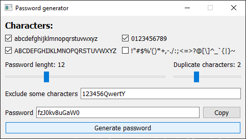
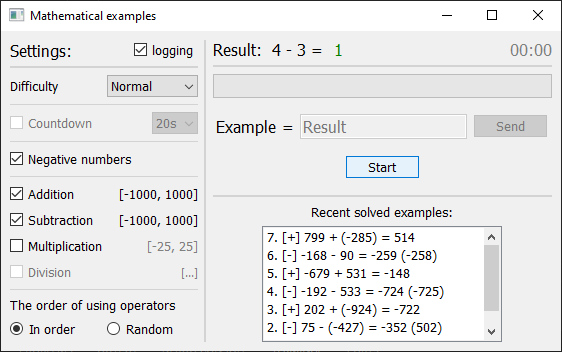
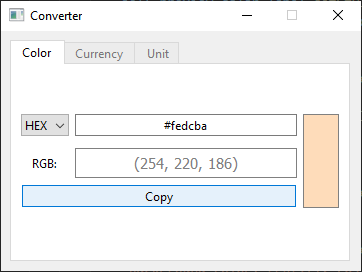

# TOOLS

<ul>
  <li>
    <a href='password_generator.py'>1. Password generator</a>
    
Simple password generator.

    
  </li>
   
  <li>
    <a href='math_examples.py'>2. Mathematical examples</a>
    
Brain workout test.

    
  </li>
   
  <li>
    <a href='converter.py'>3. Converter</a>
    
Converter of anything (so far colors ...0-0...).

    
  </li>
</ul>
