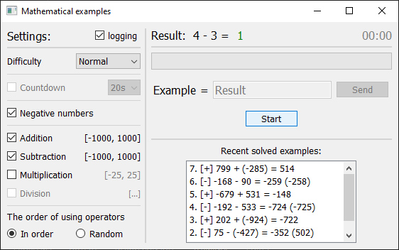

# TOOLS

- [x] [1. Password generator](password_generator.py)
    - 
Simple password generator.

    
     
- [x] [2. Mathematical examples](math_examples.py)
    - 
Brain workout test.

    
     
- [ ] ...
