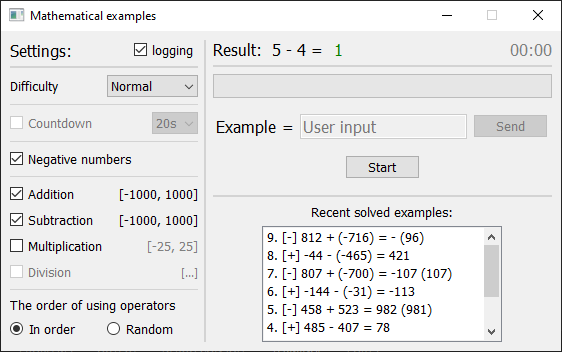

# TOOLS

<ul>
  <li>
    <a href='pyqt6/password_generator/password_generator.py'>1. Password generator</a>
    
Simple password generator.

    
  </li>
   
  <li>
    <a href='pyqt6/math_examples/math_examples.py'>2. Mathematical examples</a>
    
Brain workout test.

    
  </li>
   
  <li>
    <a href='pyqt6/converter/converter.py'>3. Converter</a>
	

    
  </li>
</ul>
